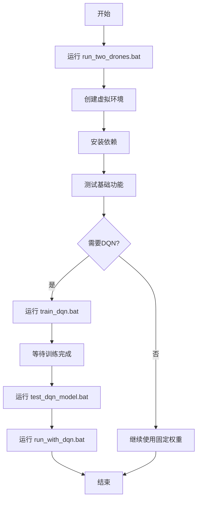

# 批处理文件使用指南

本文档说明如何使用各个批处理文件来运行和训练无人机仿真系统。

---

## 📋 批处理文件列表

| 文件名 | 功能 | 说明 |
|--------|------|------|
| `start.bat` | **主菜单** | 交互式菜单，选择不同操作 |
| `run_two_drones.bat` | 运行系统（固定权重） | 使用配置文件中的固定APF权重 |
| `run_with_dqn.bat` | 运行系统（DQN权重） | 使用DQN模型动态预测权重 |
| `train_dqn.bat` | 训练DQN模型 | 训练权重预测模型 |
| `test_dqn_model.bat` | 测试DQN模型 | 测试训练好的模型 |

---

## 🚀 快速开始

### 方法1: 使用主菜单（推荐）

直接双击运行 `start.bat`，然后按提示选择操作：

```
============================================================
   AirSim 无人机仿真系统 - 主菜单
============================================================

请选择操作:

  [1] 运行系统 (固定权重)
  [2] 运行系统 (DQN权重预测)

  [3] 训练DQN模型
  [4] 测试DQN模型

  [5] 查看系统信息
  [0] 退出

============================================================
```

### 方法2: 直接运行批处理文件

根据需要双击相应的批处理文件。

---

## 📖 详细使用说明

### 1️⃣ `start.bat` - 主菜单

**功能**: 提供交互式菜单，方便选择不同操作

**使用方法**:
1. 双击 `start.bat`
2. 输入数字选择功能
3. 执行完毕后自动返回主菜单

**优点**:
- 无需记忆各个文件名
- 统一的操作入口
- 可查看系统状态

---

### 2️⃣ `run_two_drones.bat` - 运行系统（固定权重）

**功能**: 使用固定APF权重运行无人机仿真系统

**适用场景**:
- 首次使用系统
- 测试基础功能
- 不需要AI预测权重

**使用方法**:
```bash
# 双击运行
run_two_drones.bat
```

**执行流程**:
1. 设置UTF-8编码（支持中文）
2. 激活Python虚拟环境
3. 运行算法服务器
4. 启动可视化界面

**权重配置**:
- 配置文件: `multirotor\scanner_config.json`
- 可手动编辑调整权重值

---

### 3️⃣ `run_with_dqn.bat` - 运行系统（DQN权重）

**功能**: 使用DQN模型动态预测APF权重

**前提条件**:
- ✅ 已训练DQN模型（运行过 `train_dqn.bat`）
- ✅ 存在模型文件: `multirotor\DQN\models\weight_predictor_simple.zip`

**适用场景**:
- 使用AI优化权重
- 对比DQN与固定权重的效果
- 研究强化学习应用

**使用方法**:
```bash
# 双击运行
run_with_dqn.bat
```

**执行流程**:
1. 检查DQN模型文件是否存在
2. 激活Python虚拟环境
3. 运行算法服务器（带 `--use-learned-weights` 参数）
4. DQN模型实时预测权重

**可视化区别**:
- 左上角显示: **"模式: DQN权重预测"** （绿色）
- 左下角显示: **"DQN权重预测"** 面板（绿色边框）
- 权重值实时更新

---

### 4️⃣ `train_dqn.bat` - 训练DQN模型

**功能**: 训练APF权重预测模型

**前提条件**:
- ✅ 已创建Python虚拟环境
- ✅ 已安装依赖（脚本会自动检查和安装）

**使用方法**:
```bash
# 双击运行
train_dqn.bat
```

**执行流程**:
1. 激活虚拟环境
2. 检查依赖（torch, stable-baselines3）
3. 切换到DQN目录
4. 运行训练脚本 `train_simple.py`
5. 保存模型到 `models\weight_predictor_simple.zip`

**训练参数**:
- 训练步数: 200,000 步
- 预计时间: 约 200 分钟（取决于CPU性能）
- 算法: DDPG（深度确定性策略梯度）

**训练过程**:
```
进度: [████████████████░░░░░░░░] 60.5% (121000/200000)
```

**中断训练**:
- 按 `Ctrl+C` 可随时中断
- 会保存当前训练进度的模型

**训练完成后**:
- 模型保存位置: `multirotor\DQN\models\weight_predictor_simple.zip`
- 自动进行简单测试
- 可运行 `test_dqn_model.bat` 详细测试

---

### 5️⃣ `test_dqn_model.bat` - 测试DQN模型

**功能**: 测试训练好的DQN模型

**前提条件**:
- ✅ 已训练模型（运行过 `train_dqn.bat`）

**使用方法**:
```bash
# 双击运行
test_dqn_model.bat
```

**执行流程**:
1. 检查模型文件
2. 激活虚拟环境
3. 运行测试脚本 `test_trained_model.py`
4. 显示预测的权重值

**测试输出示例**:
```
测试 1:
  预测权重: α1=2.15, α2=1.87, α3=2.43, α4=1.92, α5=2.08
  奖励: 0.50

测试 2:
  预测权重: α1=2.22, α2=1.95, α3=2.38, α4=1.88, α5=2.12
  奖励: 0.75
```

---

## ⚙️ 配置文件说明

### APF算法配置
**文件**: `multirotor\scanner_config.json`

```json
{
    "repulsionCoefficient": 2.0,
    "entropyCoefficient": 2.0,
    "distanceCoefficient": 2.0,
    "leaderRangeCoefficient": 2.0,
    "directionRetentionCoefficient": 2.0
}
```

### DQN奖励配置
**文件**: `multirotor\DQN\dqn_reward_config.json`

详细说明见: [DQN_CONFIG_GUIDE.md](multirotor/DQN/DQN_CONFIG_GUIDE.md)

---

## 🔄 工作流程

### 初次使用流程



### 日常使用流程

**只用固定权重**:
```
start.bat → [1] → 运行系统
```

**使用DQN权重**:
```
start.bat → [2] → 运行系统（DQN）
```

**重新训练模型**:
```
start.bat → [3] → 训练DQN → [4] → 测试模型 → [2] → 运行系统
```

---

## 🐛 常见问题

### Q1: 双击批处理文件后一闪而过？

**原因**: 虚拟环境未创建或路径错误

**解决**:
1. 确保在正确的目录运行
2. 先运行 `run_two_drones.bat` 创建环境
3. 右键批处理文件 → "以管理员身份运行"

---

### Q2: 提示"虚拟环境激活失败"？

**原因**: `.venv` 目录不存在

**解决**:
```bash
# 手动创建虚拟环境
python -m venv .venv
```

---

### Q3: 训练时提示"缺少依赖"？

**原因**: PyTorch 或 Stable-Baselines3 未安装

**解决**:
```bash
# 激活虚拟环境
.venv\Scripts\activate.bat

# 安装依赖
pip install torch stable-baselines3
```

---

### Q4: `run_with_dqn.bat` 提示"模型文件不存在"？

**原因**: 未训练DQN模型

**解决**:
1. 先运行 `train_dqn.bat` 训练模型
2. 或使用 `run_two_drones.bat`（固定权重）

---

### Q5: 训练时间太长？

**原因**: CPU性能或训练步数设置

**解决**:
- 修改 `multirotor\DQN\train_simple.py`
- 将 `total_timesteps = 200000` 改为更小的值（如 `50000`）
- 注意：步数越少，模型效果可能越差

---

### Q6: 中文显示乱码？

**原因**: 控制台编码问题

**解决**: 
- 批处理文件已包含 `chcp 65001` 设置UTF-8
- 如仍有问题，右键控制台标题栏 → 属性 → 选项 → 使用旧版控制台

---

## 📊 性能对比

| 模式 | 权重来源 | 实时性 | 适应性 | 学习成本 |
|------|---------|--------|--------|---------|
| 固定权重 | 配置文件 | ⭐⭐⭐ | ⭐⭐ | ⭐ |
| DQN权重 | AI预测 | ⭐⭐ | ⭐⭐⭐ | ⭐⭐⭐ |

---

## 🔗 相关文档

- [项目主README](../README.md)
- [Python项目README](README.MD)
- [DQN配置指南](multirotor/DQN/DQN_CONFIG_GUIDE.md)
- [DQN更新日志](multirotor/DQN/CHANGELOG_REWARD_CONFIG.md)

---

## 📝 注意事项

1. **首次运行**: 建议先运行 `run_two_drones.bat` 确保环境正确
2. **训练时间**: DQN训练需要较长时间，建议在空闲时运行
3. **模型保存**: 训练完成后模型会自动保存，无需手动操作
4. **配置修改**: 修改配置后需要重启程序才能生效
5. **DQN训练**: 中断训练会保存当前进度，但建议训练完整

---

**最后更新**: 2025-10-13

