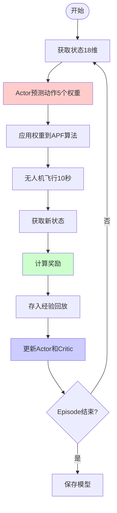

# 🤖 DDPG与DQN简介

> 深度强化学习算法在无人机权重优化中的应用

---

## 📚 目录

1. [什么是强化学习](#什么是强化学习)
2. [DQN算法介绍](#dqn算法介绍)
3. [DDPG算法介绍](#ddpg算法介绍)
4. [DDPG与DQN的关系](#ddpg与dqn的关系)
5. [为什么我们使用DDPG](#为什么我们使用ddpg)
6. [在项目中的应用](#在项目中的应用)

---

## 🎯 什么是强化学习

### 基本概念

强化学习是一种**通过试错学习**的机器学习方法。

```
┌─────────┐                    ┌─────────┐
│  Agent  │──── 动作(Action)───→│  环境   │
│  智能体 │                    │ (Env)   │
│         │←── 状态(State) ────│         │
│         │     奖励(Reward)   │         │
└─────────┘                    └─────────┘
```

**核心要素：**
- **Agent（智能体）**：做决策的主体（如：DQN/DDPG算法）
- **Environment（环境）**：Agent交互的世界（如：Unity仿真）
- **State（状态）**：环境的当前情况（如：无人机位置、速度）
- **Action（动作）**：Agent可以执行的操作（如：5个权重系数）
- **Reward（奖励）**：评价动作好坏的信号（如：探索奖励）

**目标：** 学习最优策略，使累积奖励最大化

---

## 🎮 DQN算法介绍

### Deep Q-Network（深度Q网络）

**DQN** 是 DeepMind 在2015年提出的算法，首次将深度学习与Q-Learning结合。

### 核心思想

使用**神经网络**来近似Q函数（动作价值函数）：

```
Q(s, a) = 预期累积奖励
```

- `s`：状态（State）
- `a`：动作（Action）
- `Q(s,a)`：在状态s下执行动作a的期望回报

### DQN架构

```
输入: 状态(State)
    ↓
┌─────────────────┐
│   神经网络       │
│  (Q-Network)    │
└─────────────────┘
    ↓
输出: 每个动作的Q值
[Q(s,a1), Q(s,a2), ..., Q(s,an)]
    ↓
选择最大Q值对应的动作
```

### 适用场景

✅ **离散动作空间**（如：上、下、左、右、开火）

- 适合：Atari游戏（按键选择）
- 适合：围棋（落子位置选择）
- 适合：推荐系统（推荐哪个商品）

❌ **不适合连续动作空间**（如：油门0-100%、转向角度-180°~180°）

### 关键技术

1. **经验回放（Experience Replay）**
   - 存储过往经验，随机采样训练
   - 打破数据相关性，提高学习稳定性

2. **目标网络（Target Network）**
   - 使用固定的旧网络计算目标值
   - 避免训练不稳定

---

## 🚀 DDPG算法介绍

### Deep Deterministic Policy Gradient（深度确定性策略梯度）

**DDPG** 是 DeepMind 在2016年提出的算法，将DQN扩展到**连续动作空间**。

### 核心思想

使用两个神经网络：

1. **Actor（演员）网络**：输出连续动作
2. **Critic（评论家）网络**：评估动作价值

```
      Actor: 决定做什么
      Critic: 评价做得好不好
```

### DDPG架构

```
                    ┌──────────────────┐
         状态(State)│                  │
              ├────→│  Actor Network   │──→ 动作(Action)
              │     │  (策略网络)      │
              │     └──────────────────┘
              │              ↓
              │           (梯度回传)
              │              ↓
              │     ┌──────────────────┐
              └────→│ Critic Network   │──→ Q值
      动作(Action)──→│  (价值网络)      │
                    └──────────────────┘
```

### 工作流程

1. **Actor**接收状态，输出连续动作
   ```
   输入: [位置, 速度, 方向, ...]
   输出: [权重1=1.5, 权重2=2.3, 权重3=0.8, ...]
   ```

2. **Critic**接收状态和动作，评估Q值
   ```
   输入: 状态 + Actor输出的动作
   输出: Q值（这个动作有多好）
   ```

3. **更新流程**
   - Critic学习：预测Q值，最小化TD误差
   - Actor学习：根据Critic的反馈，调整策略梯度

### 适用场景

✅ **连续动作空间**

- 适合：机器人关节控制（角度0-360°）
- 适合：自动驾驶（油门、刹车、转向）
- 适合：**权重系数优化（0.5-5.0）**← 我们的场景！

### 关键技术

1. **经验回放（Experience Replay）** - 继承自DQN
2. **目标网络（Target Networks）** - Actor和Critic各有一个目标网络
3. **软更新（Soft Update）** - 目标网络缓慢跟踪主网络
4. **探索噪声（Exploration Noise）** - 给动作添加噪声探索

---

## 🔗 DDPG与DQN的关系

### 对比表

| 特性 | DQN | DDPG |
|------|-----|------|
| **动作空间** | 离散（有限个选择） | 连续（无限个值） |
| **网络结构** | 1个Q网络 | 2个网络（Actor + Critic） |
| **输出** | 每个动作的Q值 | 具体的动作值 |
| **策略** | ε-greedy（探索） | 添加噪声（探索） |
| **目标网络** | 1个 | 2个（Actor + Critic） |
| **更新方式** | Q-Learning | Policy Gradient + Q-Learning |

### 演化关系

```
    Q-Learning (经典强化学习)
         ↓
    DQN (2015) - 加入深度神经网络
         ↓
    DDPG (2016) - 扩展到连续动作
         ↓
    TD3, SAC (更高级算法)
```

### 核心区别

#### DQN的做法：

```python
# 离散动作空间
状态 → Q网络 → [Q(上)=0.8, Q(下)=0.3, Q(左)=0.6, Q(右)=0.9]
                        ↓
                   选择"右"（Q值最大）
```

#### DDPG的做法：

```python
# 连续动作空间
状态 → Actor → [权重1=1.5, 权重2=2.3, 权重3=0.8, ...]
                    ↓
状态 + 动作 → Critic → Q值=0.85（评估这组权重）
                    ↓
              根据Q值更新Actor
```

---

## 💡 为什么我们使用DDPG

### 问题背景

我们需要优化**5个APF权重系数**：

```python
权重系数 = {
    'repulsionCoefficient': 1.2,          # 斥力系数
    'entropyCoefficient': 0.8,            # 熵系数
    'distanceCoefficient': 1.5,           # 距离系数
    'leaderRangeCoefficient': 2.0,        # Leader范围系数
    'directionRetentionCoefficient': 1.0  # 方向保持系数
}
```

**每个权重的取值范围：0.5 ~ 5.0**（连续值）

### 为什么不能用DQN？

❌ **DQN只能处理离散动作**

如果强行使用DQN，需要把连续值离散化：

```python
# 每个权重离散化为10个值
权重1 可选: [0.5, 1.0, 1.5, 2.0, 2.5, 3.0, 3.5, 4.0, 4.5, 5.0]
权重2 可选: [0.5, 1.0, 1.5, 2.0, 2.5, 3.0, 3.5, 4.0, 4.5, 5.0]
...

总共组合: 10^5 = 100,000 个动作！
```

**问题：**
- 动作空间爆炸（维度灾难）
- 无法精确调节（只能选离散值）
- 训练极其缓慢

### 为什么选择DDPG？

✅ **DDPG天然支持连续动作**

```python
# Actor直接输出连续值
输入: 当前状态[位置, 速度, 熵值, ...]
输出: [1.23, 0.87, 1.56, 2.01, 0.95]  # 精确到任意小数
```

**优势：**
- 动作空间无限，可精确调节
- Actor网络直接输出最优权重
- 学习效率高

---

## 🎯 在项目中的应用

### 我们的DDPG实现

#### 1. 状态空间（18维）

```python
状态 = [
    位置(3): [x, y, z],
    速度(3): [vx, vy, vz],
    方向(3): [forward_x, forward_y, forward_z],
    熵值(3): [平均熵, 最大熵, 标准差],
    Leader(3): [相对x, 相对y, 相对z],
    扫描(3): [完成率, 已扫描数, 未扫描数]
]
```

#### 2. 动作空间（5维）

```python
动作 = [权重1, 权重2, 权重3, 权重4, 权重5]
范围 = [0.5, 5.0]  # 每个权重
```

#### 3. 奖励函数

```python
奖励 = 探索奖励 - 越界惩罚

探索奖励 = 新扫描单元格数 × 5.0
越界惩罚 = (超出Leader范围) ? -10.0 : 0
```

#### 4. 网络结构

```python
# 使用Stable-Baselines3的DDPG实现
model = DDPG(
    "MlpPolicy",              # 多层感知器策略
    env,                      # 训练环境
    learning_rate=1e-4,       # 学习率
    buffer_size=5000,         # 经验回放缓冲区
    batch_size=64,            # 批次大小
    gamma=0.99,               # 折扣因子
    tau=0.005,                # 软更新系数
    action_noise=...,         # 探索噪声
)
```

### 训练流程



### 实际效果

**训练前（随机权重）：**
```
权重: [1.0, 1.0, 1.0, 1.0, 1.0]
探索效率: 低
经常越界: 是
平均奖励: -5.0
```

**训练后（学习的权重）：**
```
权重: [1.23, 0.87, 1.56, 2.01, 0.95]
探索效率: 高
经常越界: 否
平均奖励: +15.0
```

---

## 📊 算法性能对比

### 强化学习算法家族

```
算法演化树：

Q-Learning (1989)
    ├── DQN (2015) ───┐
    │                 │
    ├── DDPG (2016)   ├── 本项目使用
    │                 │
    ├── TD3 (2018)    │
    │                 │
    └── SAC (2018) ───┘
```

### 各算法特点

| 算法 | 动作空间 | 稳定性 | 样本效率 | 适合新手 |
|------|---------|--------|---------|---------|
| **DQN** | 离散 | ⭐⭐⭐⭐ | ⭐⭐⭐ | ✅ |
| **DDPG** | 连续 | ⭐⭐⭐ | ⭐⭐⭐⭐ | ✅ |
| **TD3** | 连续 | ⭐⭐⭐⭐⭐ | ⭐⭐⭐⭐ | ⚠️ |
| **SAC** | 连续 | ⭐⭐⭐⭐⭐ | ⭐⭐⭐⭐⭐ | ❌ |

**我们选择DDPG的原因：**
- ✅ 支持连续动作（5个权重）
- ✅ 实现简单，Stable-Baselines3有现成的
- ✅ 训练相对稳定
- ✅ 样本效率高（适合Unity仿真）

---

## 🔧 代码示例

### DQN示例（离散动作）

```python
# DQN - 用于离散动作（如：游戏按键）
from stable_baselines3 import DQN

# 动作空间：4个方向（上下左右）
env = DiscreteEnv()  # 动作：0, 1, 2, 3

model = DQN("MlpPolicy", env)
model.learn(total_timesteps=10000)

# 预测
state = env.reset()
action = model.predict(state)  # 输出：2（代表"左"）
```

### DDPG示例（连续动作）

```python
# DDPG - 用于连续动作（如：权重系数）
from stable_baselines3 import DDPG

# 动作空间：5个权重（0.5-5.0）
env = ContinuousEnv()  # 动作：[1.2, 0.8, 1.5, 2.0, 1.0]

model = DDPG("MlpPolicy", env)
model.learn(total_timesteps=10000)

# 预测
state = env.reset()
action = model.predict(state)  # 输出：[1.23, 0.87, 1.56, 2.01, 0.95]
```

---

## 📚 深入学习资源

### 论文

1. **DQN原论文**  
   "Playing Atari with Deep Reinforcement Learning" (2013)  
   作者：Mnih et al. (DeepMind)

2. **DDPG原论文**  
   "Continuous Control with Deep Reinforcement Learning" (2016)  
   作者：Lillicrap et al. (DeepMind)

### 教程推荐

- **Spinning Up in Deep RL** (OpenAI)  
  https://spinningup.openai.com/

- **Stable-Baselines3文档**  
  https://stable-baselines3.readthedocs.io/

- **强化学习圣经**  
  "Reinforcement Learning: An Introduction"  
  作者：Sutton & Barto

---

## 🎓 总结

### 核心要点

1. **DQN适合离散动作**（如：游戏、推荐系统）
2. **DDPG适合连续动作**（如：机器人、权重优化）
3. **DDPG = Actor（决策） + Critic（评价）**
4. **我们使用DDPG优化5个APF权重系数**

### 关键区别

```
DQN:  状态 → 网络 → [Q1, Q2, Q3, ...] → 选择最大Q
DDPG: 状态 → Actor → [连续动作] → Critic评价 → 更新
```

### 项目应用

```
Unity仿真 → 状态(18维) → DDPG → 权重(5维) → APF算法 → 奖励反馈
              ↑                                              ↓
              └──────────────── 学习优化 ←───────────────────┘
```

---

## ❓ 常见问题

**Q1: 为什么不用更先进的TD3或SAC？**

A: DDPG已经够用，且实现简单。TD3/SAC更稳定但更复杂，对于我们的任务来说性价比不高。

**Q2: DDPG训练不稳定怎么办？**

A: 
- 调整学习率（降低到1e-5）
- 增加经验回放缓冲区
- 调整探索噪声
- 使用TD3（DDPG的改进版）

**Q3: 为什么之前叫"DQN_Weight"文件夹，用的却是DDPG？**

A: 这是历史遗留命名问题，现已更正为 DDPG_Weight。最初考虑用DQN，后来发现需要连续动作，改用了DDPG。现在文件夹名已更新为 DDPG_Weight 以准确反映使用的算法。

**Q4: 可以换成其他算法吗？**

A: 可以！Stable-Baselines3支持多种算法：
```python
from stable_baselines3 import TD3, SAC, PPO

# 都可以替换
model = TD3("MlpPolicy", env)  # 更稳定的DDPG
model = SAC("MlpPolicy", env)  # 最先进的连续控制算法
```

---

## 🎉 结语

**DDPG是连续控制领域的经典算法**，非常适合我们的权重优化任务。通过DDPG，我们可以：

- ✅ 自动学习最优权重组合
- ✅ 适应不同环境和任务
- ✅ 持续改进探索性能

希望这份文档帮助您理解DDPG和DQN的区别！🚀

---

*文档版本: v1.0*  
*最后更新: 2025-10-27*  
*作者: AirSim团队*

