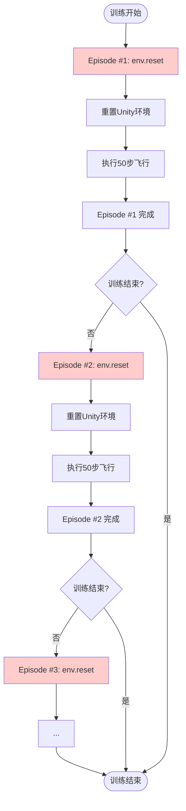

# 🔄 Episode循环与环境重置说明

> 解释训练过程中的Episode循环和环境重置机制

---

## 📚 基本概念

### 什么是Episode？

**Episode（回合）** 是强化学习中的基本训练单位：

```
一个Episode = 从环境重置 → 执行多个step → 达到终止条件
```

在我们的训练中：
- **一个Episode = 50步**（max_steps配置）
- **每步 = 10秒飞行**（step_duration配置）
- **一个Episode ≈ 8.3分钟**

---

## 🔄 完整的Episode循环

### 循环流程图



---

## 📺 实际输出示例

### Episode #1

```
============================================================
🔄 重置环境 - Episode #1
============================================================
🎮 正在重置Unity环境...
  ✅ Unity重置完成!     

📡 等待数据同步...
✅ 数据就绪！
  🗺️  网格单元: 449 个
  🚁 无人机: UAV1

============================================================
🎯 开始 Episode #1
============================================================
📊 配置:
  • Episode编号: #1
  • 最大步数: 50
  • 每步时长: 10秒
  • 预计时长: 8.3分钟
============================================================

[... 执行50步 ...]

============================================================
✅ Episode #1 完成！共 50 步
============================================================
🔄 即将自动重置环境，开始下一个Episode...
============================================================

╔══════════════════════════════════════════════════════════╗
║  🎉 Episode #1 完成！                                     ║
╠══════════════════════════════════════════════════════════╣
║  📈 本次奖励:  +125.50                                    ║
║  📏 Episode长度:   50 步                                  ║
║                                                          ║
║  🎯 训练进度: 50/5000 (1.0%)                              ║
║  ⏳ 剩余步数: 4950                                        ║
╚══════════════════════════════════════════════════════════╝

────────────────────────────────────────────────────────────
🔄 准备下一个Episode（#2）...
   环境将自动重置...
────────────────────────────────────────────────────────────
```

### Episode #2（自动开始）

```
============================================================
🔄 重置环境 - Episode #2
============================================================
🎮 正在重置Unity环境...
  ✅ Unity重置完成!     

📡 等待数据同步...
✅ 数据就绪！
  🗺️  网格单元: 449 个
  🚁 无人机: UAV1

============================================================
🎯 开始 Episode #2
============================================================
📊 配置:
  • Episode编号: #2
  • 最大步数: 50
  • 每步时长: 10秒
  • 预计时长: 8.3分钟
============================================================

[... 执行50步 ...]
```

---

## 🔧 环境重置机制

### 自动重置流程

```python
# Stable-Baselines3的内部逻辑（简化版）

for timestep in range(total_timesteps):
    action = model.predict(state)
    state, reward, done, info = env.step(action)
    
    if done:  # Episode结束
        # 🔄 自动调用reset()
        state = env.reset()  # ← 这里！
        # 新的Episode开始
```

### 我们的reset()做了什么

```python
def reset(self):
    # 1. Episode计数
    self.episode_count += 1
    
    # 2. 重置Unity环境
    if self.reset_unity:
        self.server.reset_environment()  # 发送重置命令到Unity
        time.sleep(3)  # 等待Unity重置完成
    
    # 3. 等待数据同步
    # 等待网格数据和无人机数据就绪
    
    # 4. 重置内部状态
    self.step_count = 0
    self.prev_scanned_cells = 0
    
    # 5. 返回初始状态
    return self._get_state()
```

---

## 📊 Episode生命周期

### 单个Episode的完整生命周期

```
┌─────────────────────────────────────────────────────────┐
│ Episode #1 开始                                          │
├─────────────────────────────────────────────────────────┤
│                                                         │
│  1. env.reset()                                         │
│     ├─ 重置Unity环境                                     │
│     ├─ 等待数据同步                                      │
│     └─ 返回初始状态                                      │
│                                                         │
│  2. 执行50步（max_steps）                                │
│     ├─ 步骤1: 设置权重 → 飞行10秒 → 获得奖励              │
│     ├─ 步骤2: 设置权重 → 飞行10秒 → 获得奖励              │
│     ├─ ...                                              │
│     └─ 步骤50: 设置权重 → 飞行10秒 → 获得奖励             │
│                                                         │
│  3. done = True (Episode结束)                           │
│     ├─ 显示统计信息                                      │
│     ├─ 提示即将重置                                      │
│     └─ 保存经验到replay buffer                          │
│                                                         │
│  4. DDPG模型更新                                         │
│     ├─ 从replay buffer采样                              │
│     ├─ 更新Actor网络                                     │
│     └─ 更新Critic网络                                    │
│                                                         │
└─────────────────────────────────────────────────────────┘
                         ↓
┌─────────────────────────────────────────────────────────┐
│ Episode #2 自动开始                                      │
├─────────────────────────────────────────────────────────┤
│  1. env.reset() [自动调用]                              │
│  2. 执行50步                                            │
│  3. done = True                                         │
│  4. 模型更新                                            │
└─────────────────────────────────────────────────────────┘
                         ↓
                       [继续...]
```

---

## ⚙️ 重置配置

### reset_unity参数

在创建环境时，可以配置是否重置Unity：

```python
env = SimpleWeightEnv(
    server=server,
    drone_name="UAV1",
    reset_unity=True,      # ← 是否重置Unity环境
    step_duration=10.0
)
```

#### reset_unity=True（标准模式）✅

```
每个Episode结束后：
  1. 发送重置命令到Unity
  2. Unity场景重新加载
  3. 无人机回到初始位置
  4. 网格数据清空重新生成
  5. 从头开始新的Episode

适用场景：
  ✅ 正式训练
  ✅ 需要公平对比不同策略
  ✅ 避免累积误差
```

#### reset_unity=False（连续模式）

```
每个Episode结束后：
  1. 不重置Unity环境
  2. 无人机保持当前状态
  3. 网格数据保留
  4. 继续在当前环境中训练

适用场景：
  ⚠️ 快速测试（省去重置时间）
  ⚠️ 连续学习任务
  ⚠️ 调试代码
```

---

## 🔍 如何确认重置成功

### 观察要点

1. **看到重置消息**
   ```
   🔄 重置环境 - Episode #2
   🎮 正在重置Unity环境...
   ✅ Unity重置完成!
   ```

2. **Episode编号递增**
   ```
   Episode #1 → Episode #2 → Episode #3 → ...
   ```

3. **网格数据重新加载**
   ```
   ✅ 数据就绪！
   🗺️  网格单元: 449 个
   ```

4. **步骤编号重置为1**
   ```
   🔄 步骤 1/50 (2.0%)  # 每个Episode都从1开始
   ```

5. **Unity场景变化**
   - 无人机回到起始位置
   - 地图重新生成（如果有随机性）

---

## ⏱️ 时间线示例

```
00:00 - 训练开始
00:00 - Episode #1 重置（3秒）
00:03 - Episode #1 开始（50步×10秒 = 8.3分钟）
08:20 - Episode #1 完成
08:20 - Episode #2 重置（3秒）
08:23 - Episode #2 开始（8.3分钟）
16:43 - Episode #2 完成
16:43 - Episode #3 重置（3秒）
...
```

**每个Episode = 重置时间(3秒) + 飞行时间(8.3分钟) ≈ 8.4分钟**

---

## 🛠️ 常见问题排查

### 问题1: 看不到重置消息

**可能原因：**
- 输出被其他日志覆盖
- 重置太快没注意到

**解决方法：**
- 查看是否有Episode编号递增
- 检查是否有"🔄 重置环境"消息

---

### 问题2: Episode编号不递增

**可能原因：**
- Episode没有真正结束（done未触发）
- max_steps设置过大

**解决方法：**
```python
# 检查dqn_reward_config.json
"episode": {
    "max_steps": 50  # 确保这个值合理
}
```

---

### 问题3: Unity没有实际重置

**可能原因：**
- reset_unity=False
- Unity连接断开

**解决方法：**
1. 检查创建环境时的参数
   ```python
   env = SimpleWeightEnv(..., reset_unity=True)  # 确保是True
   ```

2. 观察Unity窗口，看是否有场景重置

3. 检查日志中是否有错误

---

### 问题4: 重置时卡住

**可能原因：**
- Unity响应慢
- 等待数据超时

**解决方法：**
- 增加等待时间（修改max_wait）
- 检查Unity性能
- 重启Unity

---

## 📈 训练进度计算

### Episode数量计算

```python
# 给定参数
TOTAL_TIMESTEPS = 5000  # 总训练步数
max_steps = 50          # 每个Episode的步数

# 预计Episode数量
预计Episode数 = TOTAL_TIMESTEPS / max_steps
            = 5000 / 50
            = 100个Episode
```

### 训练时长估算

```python
# 给定参数
step_duration = 10      # 每步10秒
max_steps = 50          # 每个Episode 50步
reset_time = 3          # 重置3秒
episode_count = 100     # 100个Episode

# 每个Episode时长
episode_time = reset_time + (max_steps * step_duration)
             = 3 + (50 * 10)
             = 3 + 500
             = 503秒 ≈ 8.4分钟

# 总训练时长
total_time = episode_time * episode_count
           = 503 * 100
           = 50,300秒 ≈ 838分钟 ≈ 14小时
```

---

## 💡 优化建议

### 缩短训练时间

1. **减少步数**
   ```json
   "episode": {
       "max_steps": 20  // 50 → 20
   }
   ```

2. **缩短每步时长**
   ```python
   STEP_DURATION = 5.0  # 10 → 5秒
   ```

3. **减少总步数**
   ```python
   TOTAL_TIMESTEPS = 2000  # 5000 → 2000
   ```

### 提高训练效率

1. **增加batch_size**（如果内存足够）
2. **调整learning_rate**
3. **使用更小的buffer_size**（快速更新）

---

## 🎓 总结

### 关键要点

1. ✅ **每个Episode结束后会自动重置环境**
   - Stable-Baselines3自动调用`env.reset()`

2. ✅ **重置包括Unity场景和数据**
   - 无人机回到初始位置
   - 网格数据重新生成

3. ✅ **Episode编号会递增**
   - Episode #1 → #2 → #3 → ...

4. ✅ **每个Episode都是独立的**
   - 从相同的初始状态开始
   - 公平对比不同策略

5. ✅ **可以通过消息确认重置成功**
   - 看到"🔄 重置环境"消息
   - Episode编号递增
   - 步骤编号从1开始

---

## 🔗 相关文件

- **环境定义**: `simple_weight_env.py`
- **训练脚本**: `train_with_airsim_improved.py`
- **配置文件**: `dqn_reward_config.json`
- **输出示例**: `训练输出示例.md`

---

*文档版本: v1.0*  
*更新日期: 2025-10-27*

