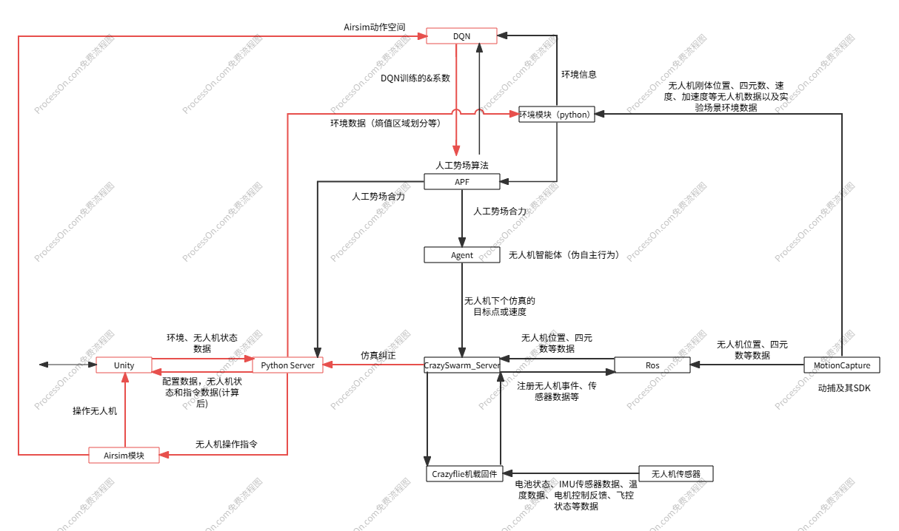
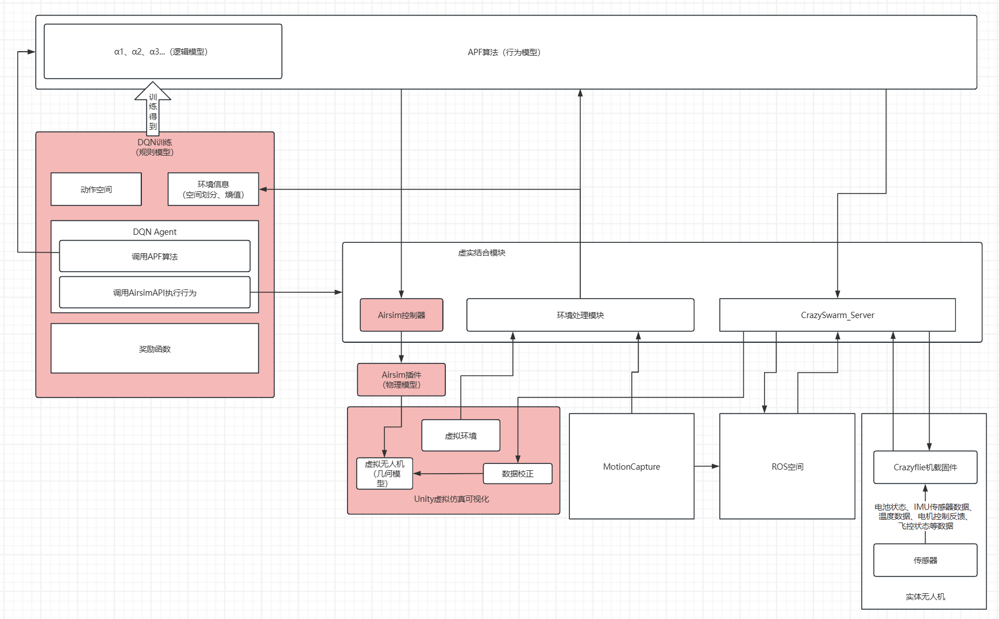

## 项目结构图

## Airsim-DQN 工作流程

## 开发方向（2025-10-09）

### 修改内容列表
1. DNQ独立模块
2. 新增DQN需要的动作空间定义，并设计如何给DNQ模型进行使用
3. 新增DQN的环境数据接收模块，并新建新的环境数据结构
4. 确定Unity环境空间划分数据结构定义
5. 去除现有服务的人工势场的算法模块
6. 新增替换人工势场的数据接入接口
7. 根据新的通信数据结构重写Python和Unity的通信模块
8. 重写Unity的通信数据处理功能
9. 新增环境数据的输出接口
10. 新增仿真纠正功能（待确认具体实现）

### 难点：
1. 如何设计DQN的动作空间，以及如何将动作空间的动作转换为人工势场的参数
2. 如何设计DQN的环境数据结构，以及如何将环境数据转换为DQN的输入数据
3. Python语言不是我的主要使用开发语言，需要花更多时间学习python的相关知识
4. DQN没接触过，需要学习相关知识，如何设计Agent，奖励函数等等
5. 时间紧张，需要在短时间内完成项目，还要移植到项目中

### 思路
1.DQN模型
2.遗传算法
3.Unity ML-Agent

### 待办事项
1. 学习行为内容
2. 同步工作内容信息给海峰
3. 协助徐杨行为对接
4. 提供时间节点，如果延误提前说明
5. 协助软著内容编写

