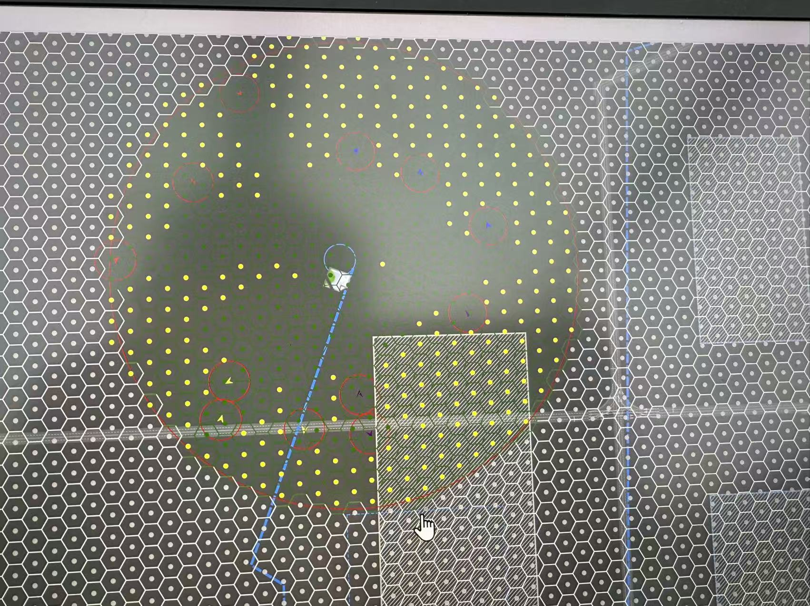

# 2025-08-15 会议工作安排

1. 无人机参数设置需要确定在哪里进行设置（模型参数）需要很细致
2. 下周二需要进行实验。
3. 研究DNQ部分实现
<!-- 
软件运行逻辑，
1.实体无人机先进行运行，参数数据实时传给虚拟无人机，虚拟无人机进行数据推演下一步，然后拿着下一步的数据与实体进行不断的比对修正。
2.无人机模型细化是通过不断去修正参数的权重最终达到一个高保真的无人机模型（物理，和推演结果更具相似等等）
3.规划模型需要通过不断去用DQN进行学习，最终得到一个自动规划的功能。（原理应该类似神经网络训练，正确路线就加奖励积分,不断迭代去训练）

事先：Airsim 模拟&训练
事中：评估（无人机运行一半确定后续路径）
临机：在线调整（比如新增一个障碍物该怎么办）
整个运行类似使用地图进行行车导航，在途中需要根据当前环境不断规划路径和算法。去判断能否到达目的地，以及油量损耗等等。

集群还要将其它无人机的状况考虑进去防止无人机相互干扰等等； -->

下周二需求：
1.无人机模型完善（包括物理模型）*
2.规划模型完善（包括DQN模型，和路径规划模型）【搁置，后续工作】
3.实验数据对接虚拟和实体【后续工作】

1. 物理模型完善（研究Airsim参数设定）
2. 物理模型文档（写Airsim里面的一些运行逻辑）
3. 路径飞行 （直线已有）
4. 场景和模型（3D）替换（卢中武）

三个实验：
1. 训练 （DQN）:
避让系数；最短路径系数; 信息熵最小化系数;
1. 评估
2. 在线调整

