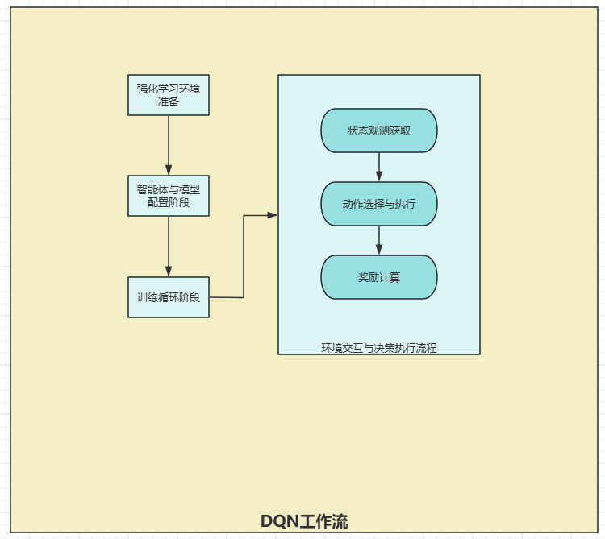

# 工程结构

# DQN分析
DQN侧重为实时决策，而不是批量训练。
### 动作空间定义
```python
def interpret_action(self, action):
    """将离散动作索引转换为三维空间中的移动偏移量

    参数:
        action: 离散动作索引(0-6)

    返回:
        quad_offset: 三维空间中的移动偏移量(x, y, z)
    """
    if action == 0:
        quad_offset = (self.step_length, 0, 0)  # 沿X轴正方向移动
    elif action == 1:
        quad_offset = (0, self.step_length, 0)  # 沿Y轴正方向移动
    elif action == 2:
        quad_offset = (0, 0, self.step_length)  # 沿Z轴正方向移动(上升)
    elif action == 3:
        quad_offset = (-self.step_length, 0, 0)  # 沿X轴负方向移动
    elif action == 4:
        quad_offset = (0, -self.step_length, 0)  # 沿Y轴负方向移动
    elif action == 5:
        quad_offset = (0, 0, -self.step_length)  # 沿Z轴负方向移动(下降)
    else:
        quad_offset = (0, 0, 0)  # 保持当前位置不变
    return quad_offset
```


# 遗传算法
## 介绍
遗传算法：有很多袋鼠，它们降落到喜玛拉雅山脉的任意地方。这些袋鼠并不知道它们的任务是寻找珠穆朗玛峰。但每过几年，就在一些海拔高度较低的地方射杀一些袋鼠。于是，不断有袋鼠死于海拔较低的地方，而越是在海拔高的袋鼠越是能活得更久，也越有机会生儿育女。就这样经过许多年，这些袋鼠们竟然都不自觉地聚拢到了一个个的山峰上，可是在所有的袋鼠中，只有聚拢到珠穆朗玛峰的袋鼠被带回了美丽的澳洲。
## 大体实现过程
遗传算法中每一条染色体，对应着遗传算法的一个解决方案，一般我们用适应性函数（fitness function）来衡量这个解决方案的优劣。所以从一个基因组到其解的适应度形成一个映射。遗传算法的实现过程实际上就像自然界的进化过程那样。

下面我们用袋鼠跳中的步骤一一对应解释，以方便大家理解：

1. 首先寻找一种对问题潜在解进行“数字化”编码的方案。（建立表现型和基因型的映射关系）  
2. 随机初始化一个种群（那么第一批袋鼠就被随意地分散在山脉上），种群里面的个体就是这些数字化的编码。  
3. 接下来，通过适当的解码过程之后（得到袋鼠的位置坐标）。  
4. 用适应性函数对每一个基因个体作一次适应度评估（袋鼠爬得越高当然就越好，所以适应度相应越高）。  
5. 用选择函数按照某种规定择优选择（每隔一段时间，射杀一些所在海拔较低的袋鼠，以保证袋鼠总体数目持平。）。  
6. 让个体基因变异（让袋鼠随机地跳一跳）。  
7. 然后产生子代（希望存活下来的袋鼠是多产的，并在那里生儿育女）。  
```
初始种群（势场法生成+扰动）    
   ↓  
适应度评估（调用势场法计算代价）  
   ↓  
选择操作（轮盘赌筛选优质航迹）  
   ↓  
交叉操作（航点交换生成子代）  
   ↓  
变异操作（航点扰动/增删/高度调整）  
   ↓  
判断是否终止？→ 否→回到适应度评估；是→输出最优航迹（后处理平滑）
```
遗传算法侧重批量训练，而不是实时决策。
